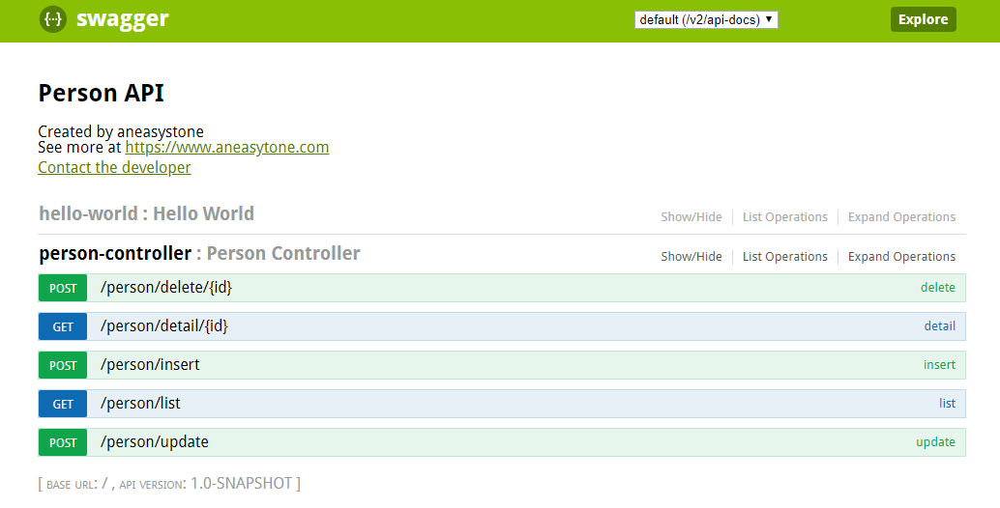
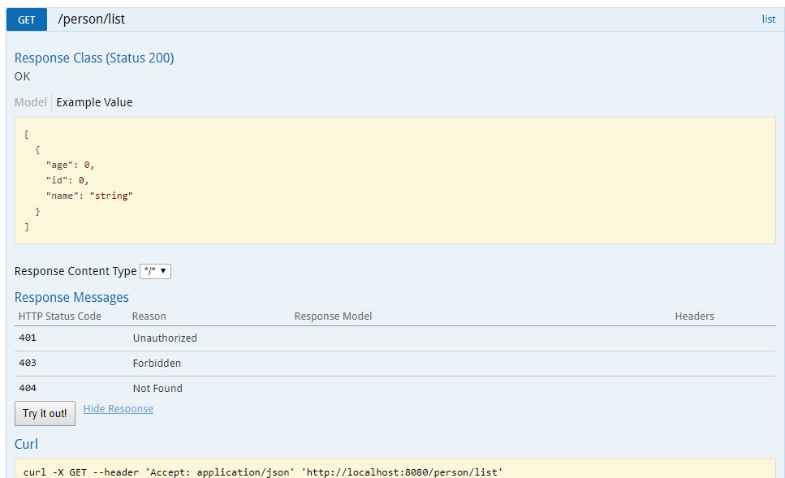

## 实战 Spring Boot 和 Swagger

在 `springboot-mybatis-mysql` 和 `springboot-mybatis-xml` 两个例子中，我们分别使用 MyBatis 的注解形式和 XML 形式实现了数据库的增删改查，并提供了操作 person 实体的相应接口，最后我们使用 curl 对接口进行测试。使用 curl 测试接口非常不方便，在命令行中拼接参数非常痛苦，特别是当你的请求体是一个庞大的 JSON 的时候。使用 Swagger 可以完美的解决这一问题，它提供的 Swagger UI 不仅可以方便的对接口进行测试，而且可以非常方便的基于 Java 注解生成相应的接口文档，这在前后端分离的开发模式中非常实用，后段开发人员通过 Swagger UI 可以维持一份及时更新且完整的 Rest API 文档，而无需手工编写，手工编写很难保证文档的及时性，这种文档久而久之也就会失去其参考意义，反而还会加大我们的沟通成本。

### Swagger 简介

Swagger 是一套基于 OpenAPI 规范构建的开源工具，可以帮助我们设计、构建、记录以及使用 Rest API。Swagger 主要包含了以下三个部分：

Swagger Editor：基于浏览器的编辑器，我们可以使用它编写我们 OpenAPI 规范。
Swagger UI：它会将我们编写的 OpenAPI 规范呈现为交互式的 API 文档，后文我将使用浏览器来查看并且操作我们的 Rest API。
Swagger Codegen：它可以通过为 OpenAPI 规范定义的任何 API 生成服务器存根和客户端 SDK 来简化构建过程。

在我们这个实例中，主要是使用 Swagger UI 生成接口文档，并通过 Swagger UI 对接口进行测试。

### 引入 Swagger UI

首先在 `pom.xml` 文件中添加 Swagger 相关的依赖：

```
        <dependency>
            <groupId>io.springfox</groupId>
            <artifactId>springfox-swagger2</artifactId>
            <version>${swagger.version}</version>
        </dependency>
        <dependency>
            <groupId>io.springfox</groupId>
            <artifactId>springfox-swagger-ui</artifactId>
            <version>${swagger.version}</version>
        </dependency>
```

其中，`springfox-swagger2` 会根据我们的配置生成每个接口的信息，并可以通过 `/v2/api-docs` 接口查看，不过是 JSON 格式的，可读性比较差，所以还需要 `springfox-swagger-ui` 来将其转化为可视化的 Web 界面。

Swagger 通过一个名叫 `Docket` 的 Bean 来初始化，所以我们还需要创建一个类似于下面 `SwaggerConfig` 这样的配置类：

```
@Configuration
@EnableSwagger2
public class SwaggerConfig {

    @Bean
    public Docket docket() {
        ApiInfo apiInfo = new ApiInfoBuilder()
                .title("Person API")
                .contact(new Contact("aneasystone", "https://www.aneasytone.com", "aneasystone@163.com"))
                .version("1.0-SNAPSHOT")
                .build();
        return new Docket(DocumentationType.SWAGGER_2)
                .apiInfo(apiInfo)
                .select()
                .apis(RequestHandlerSelectors.basePackage("com.stonie"))
                .paths(PathSelectors.any())
                .build();
    }
}
```

启动应用后，访问 `http://localhost:8080/swagger-ui.html` 即可看到 Swagger UI 的页面：



每个接口点开之后，可以大致看出入参和出参，点击 `Try it out!` 按钮，可以直接进行接口测试：



### Swagger 高级配置

* `@Api`：修饰整个类，描述Controller的作用
* `@ApiOperation`：描述一个类的一个方法，或者说一个接口
* `@ApiParam`：单个参数描述
* `@ApiModel`：用对象来接收参数
* `@ApiProperty`：用对象接收参数时，描述对象的一个字段
* `@ApiResponse`：HTTP响应其中1个描述
* `@ApiResponses`：HTTP响应整体描述
* `@ApiIgnore`：使用该注解忽略这个API
* `@ApiError`：发生错误返回的信息
* `@ApiImplicitParam`：一个请求参数
* `@ApiImplicitParams`：多个请求参数

### 参考

* [在 Spring Boot 项目中使用 Swagger 文档](https://www.ibm.com/developerworks/cn/java/j-using-swagger-in-a-spring-boot-project/index.html)
* [Spring Boot整合Swagger2构建RESTful API](https://mrbird.cc/Spring-Boot-Swagger2-RESTful-API.html)
